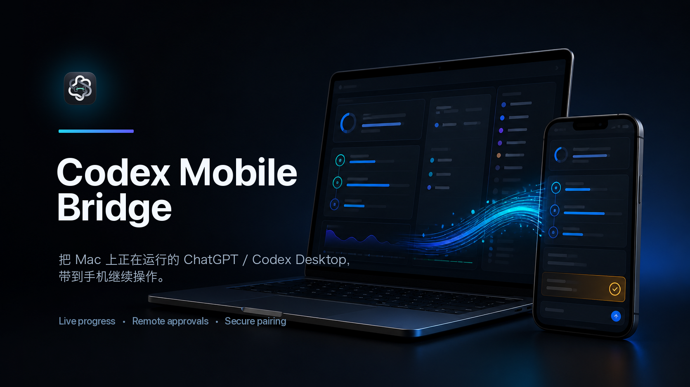
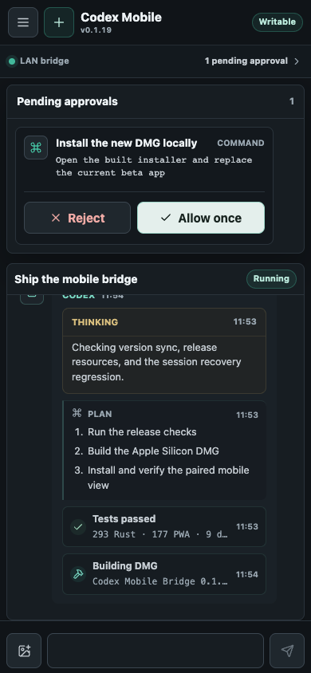
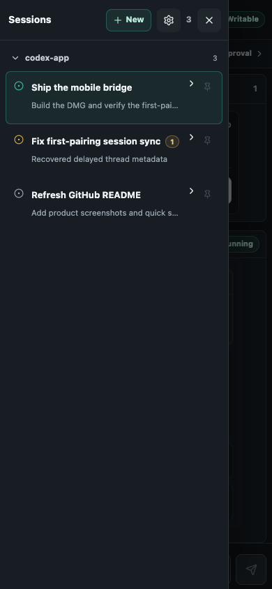
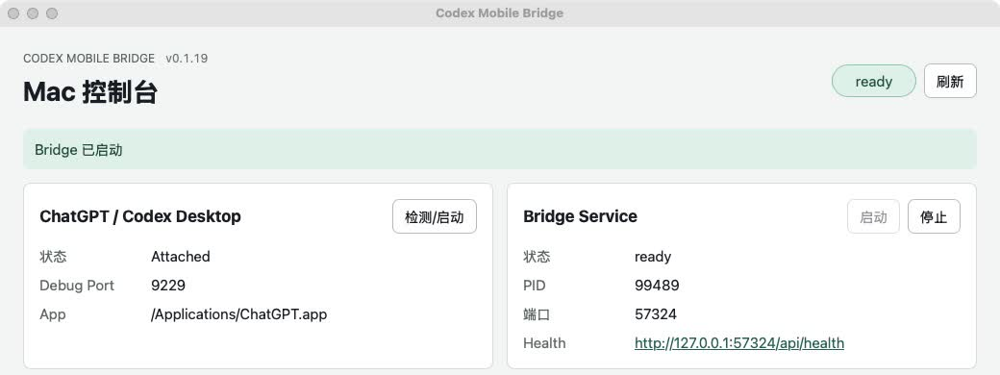

<div align="center">
  <p><a href="README.md">简体中文</a> · <strong>English</strong></p>
  
  <h1>Codex Mobile Bridge</h1>
  <p><strong>Keep working with ChatGPT / Codex Desktop on your phone while it runs on your Mac.</strong></p>
  <p>Your Mac keeps executing the task. Your phone lets you follow progress, send follow-up messages, start threads, and handle approvals.</p>
  <p>
    
    
    
    
  </p>
  <p>
    <a href="#screenshots">Screenshots</a> ·
    <a href="#quick-start-with-the-mac-app">Quick Start</a> ·
    <a href="#what-it-can-do">Features</a> ·
    <a href="#security-boundaries">Security</a> ·
    <a href="#development">Development</a>
  </p>
</div>

<p align="center">
  
</p>

> [!IMPORTANT]
> The current release is `v0.1.22 Beta`, with Apple Silicon Macs as the primary supported platform. This release fixes missing mobile approval cards and real-time events caused by a responsive-scope change in ChatGPT `26.803.41515`. Internal DMGs use ad-hoc signing and have not yet received Developer ID signing or Apple notarization.

## Screenshots

<table>
  <tr>
    <td width="50%" align="center">
      <strong>Follow progress and handle approvals from your phone</strong><br><br>
      
    </td>
    <td width="50%" align="center">
      <strong>Browse real Desktop threads by project</strong><br><br>
      
    </td>
  </tr>
</table>

<p align="center">
  <strong>The Mac app connects to Desktop, runs the Bridge, and manages remote access</strong><br><br>
  
</p>

<p align="center"><sub>The mobile screenshots were rendered from the real PWA with sanitized demo data. Pairing tokens, domains, and device details were removed from the desktop screenshot.</sub></p>

## Why use it?

- **Step away from your desk without stopping the task.** Follow long-running work, add instructions, or respond to an approval from your phone.
- **Continue the real threads already running on your Mac.** The Bridge connects to ChatGPT/Codex Desktop. It does not start a separate model session or require additional API spending.
- **Connect locally or remotely.** Use it directly on the same Wi-Fi network, through a fixed Cloudflare hostname, or with a temporary Quick Tunnel.
- **Keep access under your control.** One-time pairing links, revocable devices, authenticated APIs, Keychain storage, and sanitized diagnostics protect local data.

## What it can do

- Detect and launch the current `ChatGPT.app`, support the legacy `Codex.app`, and exclude `ChatGPT Classic`.
- Use transparent continuous-corner icons that follow current macOS conventions, with standard and maskable variants for the PWA, home-screen shortcuts, and notifications.
- Read real Desktop threads and send messages back through CDP and app-server RPC.
- Show the thread list and complete message stream in the mobile PWA, with the newest message at the bottom. Internal subagent/task threads stay out of the user thread list. On first pairing or reopening, the PWA prefers a recent, fully identified main thread instead of a UUID-only snapshot. When Desktop metadata arrives late, the Bridge retries within a bounded window and fills in the title, working directory, model, and preview.
- Organize threads as `project → thread` using canonical working directories. Project collapse state and pinned threads are stored locally on each phone.
- Open a unified thread drawer from the top navigation on phones and wider web layouts, with alert settings available from the same drawer.
- Use a two-level mobile header for primary actions, product identity, version, connection state, and long status details. The composer keeps bottom spacing compact and does not show a thread-title placeholder.
- Stream final answers, reasoning summaries, plans, and execution progress from app-server notifications. Search, file reads, directory listings, commands, tests, builds, edits, Web/MCP tools, images, and subtask activity appear as meaningful running or completed states inside one Codex response container per turn. Cursor-based HTTP sync handles recovery.
- Merge real-time tool activity with polling snapshots using stable item IDs. If a Desktop turn snapshot omits tool items, the Bridge preserves tool events already confirmed through notifications while exposing only bounded details such as a file or directory name—not full local paths or large raw payloads.
- Reconcile optimistic mobile messages, Bridge echoes, and authoritative Desktop messages. Active HTTP turn snapshots replace temporary real-time events to avoid duplicate user messages, answer fragments, and empty “Thinking” cards. Internal state transitions do not appear as raw message cards.
- Treat automatic context compaction as normal task progress instead of displaying a false error or sending an error alert.
- Send text and image attachments to an existing thread.
- Create a new thread from the phone after selecting a workspace from the Bridge-provided safe directory list.
- View and resolve approval requests captured by the Bridge. Long approval content starts collapsed, expands inside a bounded scrolling area, and keeps Reject and Allow actions visible.
- Keep devices paired across visits, restore their sessions automatically, and revoke them from the desktop app.
- Connect through LAN, a fixed Cloudflare hostname, or a temporary Quick Tunnel.
- Receive four alert types: completed, approval required, input required, and error, with distinct foreground sounds and vibration where supported.
- Use direct Web Push, lock-screen system notifications, subscription repair, and notification deep links when connected through a fixed HTTPS hostname.
- Store the fixed-hostname Tunnel Token in macOS Keychain and redact it from diagnostics.
- Keep sidecar startup logs limited to non-sensitive details such as the listening address, PWA asset readiness, and connection state. Local paths, pairing links, and the Local Control Token are not logged.

## Current limitations

- Only macOS is currently implemented. Internal DMGs have been verified on Apple Silicon.
- The Mac must stay awake, online, and running both ChatGPT/Codex Desktop and the Bridge Service.
- The mobile client is a PWA, not a native App Store or Android app.
- The phone only displays reasoning summaries and structured execution details exposed by ChatGPT/Codex Desktop or the provider. It does not expose or fabricate hidden chain-of-thought.
- Quick Tunnel and LAN connections provide foreground page alerts only. Reliable lock-screen notifications require a fixed HTTPS hostname.
- On iPhone, the PWA must be added to the Home Screen and launched from there before it can request system notification permission. iOS ultimately controls lock-screen sound and vibration.
- In the current MVP, a paired phone is trusted as a local user. Fine-grained authorization is not implemented yet.
- Internal DMGs use ad-hoc signing, without Apple Developer ID signing or notarization, and are not stable public releases.
- CLI adapters and Windows/Linux support are not implemented yet.

## How it works

```text
Phone PWA
   |  authenticated HTTP / WebSocket
   v
Bridge Sidecar <--- Desktop Shell manages process, pairing, and tunnels
   |
   |  CDP + app-server RPC
   v
ChatGPT.app / Codex.app
```

The Bridge does not modify the ChatGPT/Codex application bundle. The desktop shell launches or reattaches to the app with a remote debugging port and manages the sidecar, pairing links, and Cloudflare connector.

## Quick start with the Mac app

1. Install and open `Codex Mobile Bridge.app`. Confirm that the version shown in the window matches the installer.
2. Use the detect or launch control for ChatGPT/Codex. If the desktop app is already running without CDP enabled, allow the Bridge to restart it when prompted.
3. Select `Bridge Service / Start` and wait for the status to become `ready`. The phone can send messages only when the connection state is `writable`.
4. Choose an access method:
   - Same Wi-Fi network: use the LAN address directly.
   - Ongoing remote access: configure a fixed Cloudflare hostname.
   - Temporary fallback: start a Quick Tunnel manually.
5. In the Phone Pairing section, select `Generate New Link` and scan the QR code with your phone.

### Pairing-link rules

- A complete URL containing `pairingToken=...` is a one-time pairing entry point. It cannot pair another browser after it is used or expires.
- After pairing succeeds, the same phone and browser can reopen the current Bridge root URL repeatedly.
- Generate a new pairing link after switching browsers, clearing site data, revoking a device, or seeing `Unpaired`, `Needs new link`, or `Session revoked or expired`.
- Do not forward a URL containing a `pairingToken` to anyone else.

## Fixed Cloudflare hostname

A fixed hostname is intended for Macs that stay online and need repeatable remote access. It requires a domain managed by Cloudflare but does not require router port forwarding.

### 1. Create a Named Tunnel

1. Sign in to [Cloudflare Zero Trust](https://one.dash.cloudflare.com/).
2. Go to `Networks` → `Connectors` → `Cloudflare Tunnels`.
3. Create a `Cloudflared` tunnel, for example `codex-mobile-bridge`.
4. On the connector installation page, copy only the long Tunnel Token after `--token`.

Do not run the full `cloudflared service install ...` command shown by Cloudflare. The Bridge uses its bundled `cloudflared` binary and manages the connector lifecycle itself.

### 2. Add a published application route

Add this route under the tunnel's published application routes:

| Field | Example |
| --- | --- |
| Public Hostname | `codex.example.com` |
| Path | Leave empty |
| Service Type | `HTTP` |
| Service URL | `localhost:57324` |

You do not need to create another CNAME manually. Do not add a Cloudflare Access login page, caching, or rewrite rules to this subdomain.

### 3. Connect it in the Bridge

1. Open Remote Access and choose Fixed Hostname.
2. On the `Create Tunnel` screen, confirm that the origin is `http://localhost:57324`, then continue.
3. Under `Connect Bridge`, enter:
   - `Public Hostname`: the full subdomain without `https://`.
   - `Tunnel Token`: the token only, not the terminal command.
   - `Local Port`: `57324`.
4. Save the configuration, continue to `Verify`, and select `Start Verification`.
5. Configuration is complete only when all four checks are `ready`:
   - `Local Bridge`
   - `Cloudflare connection`
   - `Public health`
   - `Same Bridge instance`

If the fixed hostname fails, the Bridge performs only a limited number of retries and does not silently change the connection address. Update the configuration, run verification again, or start a temporary tunnel manually.

### Removing an accidentally installed system connector

If you previously ran `cloudflared service install ...`, the Mac may have both a system connector and a Bridge-managed connector. After all four Bridge verification checks are `ready`, you can run:

```bash
sudo /opt/homebrew/bin/cloudflared service uninstall
```

This removes only the duplicate local system service. It does not delete the Cloudflare Tunnel, its DNS route, or the token stored by the Bridge in Keychain.

## Temporary Quick Tunnel

- Quick Tunnel generates a temporary `trycloudflare.com` address.
- The address may stop working when the process exits, the Mac sleeps, the network changes, or Cloudflare reclaims it.
- The Bridge never falls back to Quick Tunnel automatically when a fixed hostname fails. You must start it explicitly.
- Use Quick Tunnel as a temporary fallback, not as a stable URL to distribute or bookmark.

## Mobile behavior

- The thread list comes from real ChatGPT/Codex Desktop threads, not a separate cloud database.
- The Bridge traverses `thread/list` cursor pages within defined bounds, so an older thread that is pinned or still active is not lost just because it is absent from the first page.
- During initial pairing, a real-time notification may create a temporary UUID-only snapshot before full metadata arrives. The phone skips that snapshot in favor of a fully identified main thread. The Bridge retries metadata hydration with bounded 1–30 second backoff, filling in the title, working directory, model, and preview without overwriting confirmed status, update time, or pending approvals.
- Threads are grouped into projects by canonical `cwd`. Mobile collapse and pin state are local preferences and do not depend on Desktop's private UI store.
- The selected thread requests only a bounded event window and loads older history through cursor pagination instead of transferring the entire thread every time.
- Authenticated WebSocket notifications deliver app-server changes incrementally. HTTP cursor responses remain authoritative for recovery and calibration; only local pending messages that have not received a server echo are retained temporarily.
- The reasoning area shows only a Desktop-displayable reasoning summary. Final answers, plans, and tool states use separate event types.
- Connection details use a two-level header with the version below the product name. Long status text remains on one truncated line and opens in a bottom sheet. Long approvals collapse by default and scroll only within their content area when expanded, so the actions remain visible. The composer keeps a visually empty placeholder and compact bottom spacing.
- A new thread must use a working directory currently returned by the Bridge. The phone cannot browse the entire Mac filesystem.
- Image attachments pass through an authenticated local asset proxy. Event responses and diagnostics do not reveal full local paths.

## Mobile alerts

- Settings provides separate controls for completed, approval required, input required, and error alerts, with previews for all four foreground sounds.
- A fixed HTTPS connection can enable system notifications. Status is reported as `Active`, `Not enabled`, `Blocked`, `Needs repair`, or `Unavailable`.
- `Repair notifications` removes stale browser and Bridge subscriptions before registering again. `Disable alerts` first turns off the server-side master switch and then attempts to clean up both subscriptions.
- When the page is visible, normal push events are forwarded to it and deduplicated with WebSocket events using the same `eventId`. In the background or on the lock screen, the Service Worker displays a system notification.
- Selecting a system notification focuses or opens the PWA, waits for the thread list, and then selects the matching thread. If the thread no longer exists, the PWA shows an explicit message.
- Because Quick Tunnel addresses are unstable, they do not request or reuse PushSubscriptions and do not promise lock-screen notifications.

## Security boundaries

- One-time pairing tokens expire and become invalid immediately after successful use.
- Thread APIs, image resources, and WebSocket connections require an authenticated paired-device session.
- The Local Control API is never mounted on the public phone router.
- Every sidecar launch rotates the Local Control Token and clears legacy sidecar stdout/stderr logs before writing new logs. Unused pairing links from an old sidecar process expire when that process exits.
- The Tunnel Token is stored in macOS Keychain. When `cloudflared` starts, the token is supplied through a temporary permission-restricted file, never through command-line arguments or diagnostics.
- The VAPID private key is stored in macOS Keychain, passed to the sidecar through a one-time `0600` file, and deleted immediately after it is read. PushSubscriptions and the delivery outbox are bound to authenticated devices.
- Web Push payloads contain only the event type, thread ID/title, and timestamp—not message content, the working directory, tool arguments, or error details.
- Fixed Hostname and Quick Tunnel modes are mutually exclusive. Turning off remote access stops the Bridge-managed connector.
- There is currently no account system or approval risk tiering. Pair only trusted devices and revoke a lost device immediately from the desktop app.
- Do not expose port `57324` directly to the public internet.

## Development

You need Rust, Node.js/npm, Xcode Command Line Tools, and the macOS build environment required by Tauri 2.

### Build-cache management

Build entry points locate the main worktree through the Git common directory and share a sibling `codex-app-shared-target/` across all Git worktrees. This avoids duplicating Rust/Tauri build artifacts for every task copy. Incremental compilation is disabled in the development and test profiles to limit disk growth.

The repository provides a Cargo wrapper with cache checks. If the shared directory reaches 20 GB before or after a build, it prints a terminal warning and sends one macOS notification. It does not start a background service or delete files automatically:

```bash
./scripts/cargo.sh test --workspace
./scripts/check-build-cache.sh
./scripts/cargo.sh clean
```

After the cache falls below the threshold, the next threshold crossing can notify again. Prefer the repository scripts so worktrees in any location resolve the same shared directory. Calling Cargo directly bypasses the warning and may use a separate fallback target for worktrees under a different parent directory.

### Tests and checks

```bash
./scripts/cargo.sh test --workspace
./scripts/cargo.sh clippy -p desktop-shell -- -D warnings

cd apps/mobile-pwa
npm ci
npm test -- --run
npm run build

cd ../desktop-shell
npm ci
npm test -- --run
npm run build

cd ../..
./scripts/check-version-sync.sh
```

### Desktop development

```bash
./scripts/cargo.sh build -p bridge-sidecar
(cd apps/mobile-pwa && npm ci && npm run build)

cd apps/desktop-shell
npm ci
npm run tauri:dev
```

Development mode locates the repository root automatically and supports:

- `CODEX_MOBILE_BRIDGE_SIDECAR_BIN`: defaults to `debug/bridge-sidecar` in the shared target directory.
- `CODEX_MOBILE_BRIDGE_PWA_DIR`: defaults to `apps/mobile-pwa/dist`.
- `CODEX_MOBILE_BRIDGE_ADVERTISED_HOST`: automatically attempts to use a Wi-Fi/LAN address when unset.
- `CODEX_MOBILE_BRIDGE_DEBUG_PORT`: defaults to `9229`.

### Build a DMG

```bash
cd apps/desktop-shell
npm ci
npm run tauri:build -- --bundles dmg
```

The build first compiles the release sidecar and PWA, places `bridge-sidecar` and `cloudflared` in the app resources, and then runs Tauri packaging. The DMG is written to:

```text
<output of scripts/cargo-target-dir.sh>/release/bundle/dmg/
```

Without an official Apple certificate, development builds use ad-hoc signing automatically. This verifies app-bundle integrity but is not equivalent to Developer ID signing or Apple notarization.

## Diagnostics

For both local and public connections, check:

```text
/api/health
```

A healthy response includes:

- `status: ok`
- `connectionState: writable`
- the current `version`
- the current `instanceId`

When verifying a fixed hostname, local and public `version` and `instanceId` values must match. If the public endpoint returns an old version, an old sidecar is usually still holding the fixed port. If Cloudflare appears healthy after the Bridge connector stops, a separate system connector may still be installed on the Mac.

Common desktop degradation states:

- `codex_not_running`: ChatGPT/Codex is not running or has not completed valid diagnostics.
- `cdp_unavailable`: the remote debugging port cannot be reached.
- `target_not_found`: CDP is reachable, but no supported desktop page target was found.
- `inject_failed`: a page was found, but app-server bridge injection failed.
- `rpc_unavailable`: injection succeeded, but the basic app-server RPC is unavailable.
- `read_only`: threads can be read, but messages cannot be sent.
- `writable`: threads can be read and messages can be sent.

## Testing and release

- Internal manual QA: [docs/dogfood-qa-checklist.md](docs/dogfood-qa-checklist.md)
- Release gates: [docs/release-gates.md](docs/release-gates.md)
- Web Push device matrix: [docs/qa/2026-07-18-web-push-device-matrix.md](docs/qa/2026-07-18-web-push-device-matrix.md)
- Fixed-hostname implementation plan: [docs/superpowers/plans/2026-07-18-fixed-domain-named-tunnel.md](docs/superpowers/plans/2026-07-18-fixed-domain-named-tunnel.md)
- The GitHub Actions `Desktop build` workflow can produce dev/beta DMGs.
- A stable release requires Developer ID signing, Apple notarization, and updater metadata.

## Acknowledgements

- [BigPizzaV3/CodexPlusPlus](https://github.com/BigPizzaV3/CodexPlusPlus) inspired the CDP bridge and mobile relay direction.
