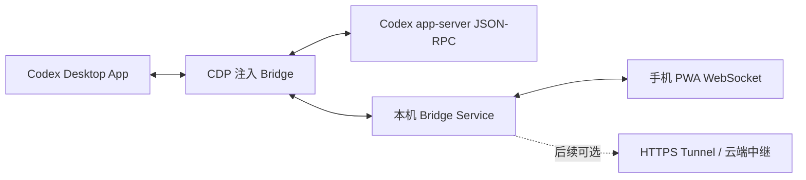
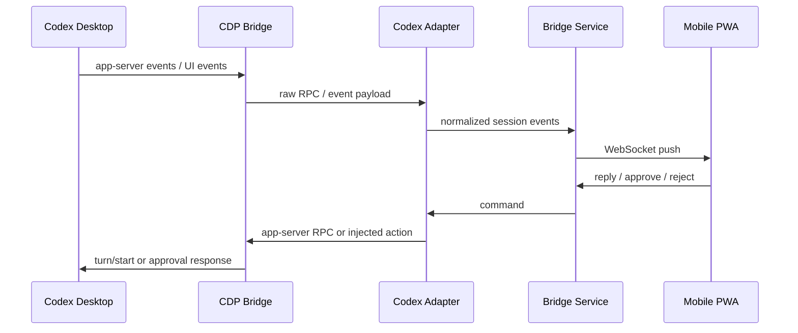

# Codex Mobile Bridge 设计规格

日期：2026-07-08

## 背景

大量中国用户没有 ChatGPT / Codex 官方订阅，常通过中转 API 使用 Codex。这个使用方式可以解决模型调用问题，但无法自然获得 Codex App 在手机端继续对话、确认任务、处理审批请求的体验。用户离开电脑后，桌面 Codex 任务经常卡在“等待用户确认”或“需要补充输入”的状态。

本项目第一版不做完整移动端 Codex，也不做中转 API 客户端。MVP 聚焦一个窄闭环：Codex 仍在电脑上运行，手机只作为远程会话查看、文本回复和审批确认入口。

参考项目 BigPizzaV3/CodexPlusPlus 证明了一个现实可行的方向：通过外部 launcher 启动 Codex Desktop App，打开 Chromium DevTools Protocol remote debugging port，再注入 bridge 脚本与 Codex App 内部 app-server 通信。它还包含一个独立的 mobile relay 原型，已验证移动 WebSocket relay 与 app-server JSON-RPC 访问会话列表、会话内容、发送消息的可行性。本项目吸收这个技术路线，但产品边界独立，不引入 CodexPlusPlus 的 provider 管理、插件市场、广告、模型配置等宽范围能力。

## 目标

- 在 macOS 上优先接入 Codex Desktop App。
- 手机 PWA 能通过局域网连接电脑上的本机 Bridge Service。
- 手机能查看完整会话流、最近会话列表和实时输出状态。
- 手机能向当前 Codex thread 发送文本回复。
- 手机能看到待审批事件，并批准或拒绝，让桌面任务继续执行。
- 首次扫码后形成长期设备绑定，后续可自动重连。
- 电脑端可以撤销已绑定设备。
- 架构保留 CLI adapter、Windows/Linux adapter、公网 tunnel、云端中继和原生 App 的后续扩展空间。

## 非目标

- 不做完整手机端 IDE。
- 不做原生 iOS / Android App。
- 不做云端账号、多租户服务或托管中继。
- 不做中转 API 配置、模型请求代理、余额管理或供应商切换。
- 不实现 Windows / Linux adapter。
- 不做完整远程控制，例如暂停任务、终止任务、切换 workspace、重试步骤。
- 不做复杂授权策略，例如风险分级、workspace 白名单和高风险二次确认。
- 不替代 Codex Desktop App 的主界面。

## MVP 验收标准

完整 MVP 由第一至第三阶段共同构成。第一阶段只是内部技术闭环，不是对外可用版本。

MVP 完成时必须满足：
- 同一局域网内，手机扫码后能打开 PWA 并完成长期设备绑定。
- 电脑端能显示并撤销已绑定设备。
- Bridge Service 能连接 macOS Codex Desktop App，并显示明确连接状态。
- 手机端能查看最近会话列表和任一会话的完整文本流。
- Codex 生成回复时，手机端能看到实时增量输出或合理的刷新同步。
- 手机端发送文本后，Codex Desktop App 对应 thread 能继续执行。
- 当 Codex 出现可捕获审批请求时，手机端能展示审批卡片并批准或拒绝。
- 未绑定设备、已撤销设备、过期 pairing token 都不能访问会话数据。
- 当 CDP 注入或 app-server RPC 不可用时，PWA 显示明确降级原因，而不是静默失败。

## 总体架构

MVP 采用本机 sidecar 架构。Codex Desktop App 仍是任务执行主体，Codex Mobile Bridge 只负责事件同步和远程输入回写。



第一版只交付 macOS Desktop App 路径。Bridge Service 用 launcher 或 attach manager 打开 Codex 的 remote debugging port，通过 CDP 找到 Codex page target，并注入 bridge 脚本。注入脚本连接 Codex App 内部 app-server RPC，读取会话、订阅事件，并把手机端命令回写给 Codex。

若 CDP / app-server 路径不可用，产品进入降级状态：优先只读同步，再尝试注入脚本补丁，最后才考虑 UI adapter。CLI adapter 保留为后续实现，不主导 MVP。

## 模块边界

### Launcher / Attach Manager

负责发现、启动或附着 Codex Desktop App。

职责：
- 检测 Codex App 路径。
- 启动 Codex 时附带 `--remote-debugging-port` 和必要的 allow origin 参数。
- 查询 CDP targets，选择 Codex page target。
- 注入 bridge 脚本并执行 health check。
- 记录注入状态：未启动、连接中、已注入、只读降级、注入失败。

### Codex Adapter

封装 Codex Desktop App 的 app-server JSON-RPC 和注入动作。

对上暴露统一接口：
- `listThreads()`
- `resumeThread(threadId)`
- `listTurns(threadId)`
- `sendUserMessage(threadId, text)`
- `subscribeEvents(threadId?)`
- `respondApproval(approvalId, decision)`

后续 CLI adapter 也实现同一接口，避免手机端和 Bridge Service 依赖具体 Codex 形态。

### Event Normalizer

把 Codex 内部事件转换成稳定业务事件。Codex 内部字段、事件名、返回结构可能随版本变化，PWA 不能直接依赖这些细节。

输出事件包括：
- `SessionSnapshot`
- `SessionEvent`
- `MessageDelta`
- `ApprovalRequest`
- `ApprovalResult`
- `ConnectionState`

### Bridge Service

本机 HTTP / WebSocket 服务，是手机端唯一访问入口。

职责：
- 提供二维码配对入口。
- 管理设备绑定和撤销。
- 静态托管 PWA。
- 提供会话快照 API。
- 通过 WebSocket 推送实时事件。
- 接收手机端文本回复、审批决策，并调用 Codex Adapter 回写。

### Device Pairing Store

保存已绑定设备和会话凭证。

数据包括：
- `deviceId`
- 设备显示名
- 设备公钥或密钥派生信息
- 创建时间
- 最后连接时间
- 撤销状态

### Mobile PWA

手机端只和 Bridge Service 通信，不直接访问 Codex、app-server、CDP 或 API Key。

主要视图：
- 连接状态栏
- 待处理队列
- 会话列表
- 会话详情
- 文本输入框

## 数据流



Bridge Service 对手机端维护一个稳定协议。Codex 版本变化只应影响 Codex Adapter 和 Event Normalizer。

## 核心数据模型

```ts
type SessionSnapshot = {
  threadId: string
  title: string
  cwd?: string
  modelProvider?: string
  preview?: string
  updatedAt: number
  status: "idle" | "running" | "waiting_for_input" | "waiting_for_approval" | "error"
  pendingApprovalIds: string[]
}

type SessionEvent = {
  id: string
  threadId: string
  type:
    | "message"
    | "message_delta"
    | "tool_call"
    | "tool_result"
    | "approval_requested"
    | "approval_resolved"
    | "status_changed"
    | "error"
  payload: unknown
  createdAt: number
}

type ApprovalRequest = {
  id: string
  threadId: string
  kind: "command" | "file_edit" | "network" | "mcp" | "unknown"
  title: string
  detail: string
  riskHint?: string
  raw?: unknown
  createdAt: number
  expiresAt?: number
}

type ApprovalDecision = {
  approvalId: string
  decision: "approve" | "reject"
  comment?: string
  deviceId: string
  decidedAt: number
}
```

## 审批捕获与回写

审批是 MVP 最大技术风险。实现按三层策略推进：

第一层：app-server 事件优先。订阅 app-server JSON-RPC 通知，识别待确认状态。实现阶段需要通过真实 Codex 会话抓样本，确认审批相关事件名和 payload。

第二层：注入脚本补丁。如果 app-server 不直接广播审批事件，就通过 CDP 注入 patch 前端 action 或 app-server client。CodexPlusPlus 已证明可以加载 `app-server-manager-signals-` 模块并 patch client 的 `sendRequest`，本项目可沿用这个方向捕获审批请求和审批提交动作。

第三层：UI adapter 兜底。若内部结构变化导致前两层不可用，短期通过 DOM 识别审批卡片和按钮。此方式只作为降级方案，不作为主架构。

MVP 安全策略是：已配对手机的审批等同本机用户审批。协议保留 `kind`、`riskHint`、`deviceId`，为后续风险分级、workspace 策略和审计日志预留空间。

## 配对与安全

第一版不做账号，安全边界是“这台电脑信任哪些手机设备”。

配对流程：

1. Bridge Service 启动后生成一次性 pairing token 和二维码。
2. 手机扫码打开 PWA，二维码携带 `bridgeUrl`、`pairingToken`、`serverPublicKey`。
3. 手机生成 `deviceId` 和设备密钥，向电脑发起配对请求。
4. Bridge Service 校验 pairing token，写入设备绑定。
5. pairing token 成功使用后立即失效，默认 5 分钟过期。
6. 后续手机用设备凭证自动重连。
7. 电脑端可撤销设备；撤销后设备不能继续连接。

局域网默认地址：

```text
http://<电脑局域网 IP>:<port>
ws://<电脑局域网 IP>:<port>/ws
```

本地管理接口默认只绑定 `127.0.0.1`。手机访问接口绑定局域网 IP，但所有 API 和 WebSocket 都必须通过设备认证。

局域网 HTTP 下 WebCrypto 安全上下文支持有限。MVP 采用务实策略：
- HTTPS / tunnel / localhost 场景使用 WebCrypto 做加密 envelope。
- 局域网 HTTP 场景使用 pairing token、设备签名和短期 session token。
- 文档明确建议只在可信局域网使用；离开可信网络时使用 HTTPS tunnel。

## PWA 信息架构

PWA 第一屏是工作台，不做 landing page。

### 连接状态栏

显示电脑名、Codex 状态、Bridge 状态和网络模式。

状态包括：
- 未连接
- 已连接
- Codex 未启动
- 注入失败
- 只读降级
- 可回写

### 待处理队列

优先展示 `ApprovalRequest` 和等待用户输入的事件。每张卡片显示请求类型、摘要、所属 thread、时间，以及批准/拒绝按钮。

### 会话列表

按 workspace 分组展示最近 thread。显示标题、预览、更新时间、是否有待处理事件。列表用于切换会话，不承担主要操作。

### 会话详情

展示完整会话流，包括用户消息、Codex 输出、工具调用摘要和审批记录。底部固定输入框发送补充文本。实时输出要合并 delta，避免一字一刷导致页面跳动。

关键交互原则：推送打扰只给待处理事件，完整会话流留在 PWA 内查看。局域网 MVP 不要求系统推送。

## 技术栈

### Sidecar

使用 Rust。

推荐依赖方向：
- `tokio`：异步运行时。
- `tokio-tungstenite`：WebSocket。
- `reqwest`：查询 CDP targets。
- `serde` / `serde_json`：协议模型。
- `rusqlite`：设备绑定、事件游标和状态存储。

### PWA

使用 React + Vite。构建产物由 Bridge Service 静态托管。第一版不需要重型组件库，重点是移动端可读性、稳定布局和快速操作。

### 本地存储

设备绑定、事件游标、最近会话摘要使用 SQLite。配置可以先放 JSON，但如果实现成本可控，统一 SQLite 更利于后续扩展。

### 协议

HTTP 负责：
- 配对
- 设备管理
- 会话快照
- PWA 静态资源

WebSocket 负责：
- 实时会话事件
- 消息 delta
- 审批请求
- 手机端命令回写

协议应使用业务事件模型，而不是简单转发 Codex 原始 JSON。

## 阶段拆分

### 第一阶段：本机可用闭环

- macOS Bridge Service。
- Codex Desktop App CDP 连接。
- bridge 注入 health check。
- app-server RPC：`initialize`、`thread/list`、`thread/resume`、`thread/turns/list`、`turn/start`。
- PWA 会话列表、会话详情、文本发送。
- 局域网二维码访问。

### 第二阶段：审批闭环

- 捕获审批事件。
- 手机展示审批卡片。
- 手机批准/拒绝并回写 Codex。
- 审批结果进入会话流。
- 捕获失败时显示明确降级状态。

### 第三阶段：稳定性

- 长期设备绑定。
- 设备撤销。
- 断线恢复。
- 事件游标。
- 诊断页。
- Codex 版本兼容探测。

### 第四阶段：远程能力

- HTTPS tunnel provider 接口。
- Web Push 或原生 App 评估。
- 可选云端中继。

### 第五阶段：安全增强

- 风险分级。
- workspace 策略。
- 高风险二次确认。
- 审计日志。

## 测试策略

- CDP 连接测试：能否通过 remote debugging port 找到 Codex page target。
- 注入测试：bridge 注入后能否完成 health check。
- app-server RPC 测试：基础方法是否可用。
- 流式事件测试：输出过程中能否收到 delta、completed、status changed。
- 审批测试：构造命令、文件编辑、联网等需要确认的任务，验证捕获和回写。
- 断线恢复测试：手机刷新、WebSocket 断开、Codex 重启、Bridge 重启后状态恢复。
- 安全测试：未配对设备不能连接；撤销设备不能重连；过期 pairing token 不能使用。
- PWA 响应式测试：移动端文字不重叠，审批卡片和底部输入框不互相遮挡。

## 风险与兜底

- Codex 内部 app-server 模块名变化：使用多候选探测，失败进入只读或 UI adapter 降级。
- 审批事件不走 app-server：通过注入脚本 patch 前端 action；仍失败则 DOM 识别。
- 局域网 HTTP 安全能力有限：文档限制使用场景，后续通过 HTTPS tunnel 解决。
- 手机端实时流太吵：合并 delta，默认突出待处理事件。
- 误批准风险：MVP 采用已配对即可信任，后续加入风险分级和 workspace 策略。
- CodexPlusPlus 参考实现范围过宽：本项目不引入 provider 管理、插件市场、广告和模型配置，避免产品目标漂移。

## 参考

- BigPizzaV3/CodexPlusPlus：<https://github.com/BigPizzaV3/CodexPlusPlus>
- CodexPlusPlus mobile relay 原型：<https://github.com/BigPizzaV3/CodexPlusPlus/blob/main/apps/codex-plus-mobile-relay/src/main.rs>
- CodexPlusPlus launcher：<https://github.com/BigPizzaV3/CodexPlusPlus/blob/main/crates/codex-plus-core/src/launcher.rs>
- CodexPlusPlus CDP bridge：<https://github.com/BigPizzaV3/CodexPlusPlus/blob/main/crates/codex-plus-core/src/bridge.rs>
