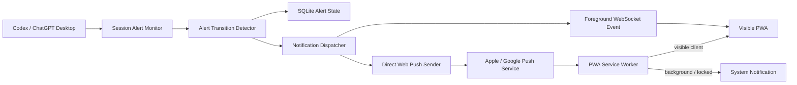

# Codex Mobile 多状态任务提醒与固定域名设计

Date: 2026-07-18

## 背景

Codex Mobile Bridge 当前允许手机通过局域网或 Cloudflare Quick Tunnel 查看 Codex / ChatGPT Desktop 会话、发送消息、处理审批和创建新会话。但任务状态只会在手机 PWA 主动轮询 `/api/sessions` 时刷新。手机锁屏或 PWA 进入后台后，浏览器会暂停或显著降低轮询频率，因此用户无法可靠得知任务何时完成、何时等待审批、何时需要补充输入或何时发生错误。

本设计增加可配置的多状态提醒，并为可靠的锁屏 Web Push 增加用户自有 Cloudflare 固定域名模式。没有固定域名的用户继续使用自动创建的 Quick Tunnel，但只提供前台提醒，并明确显示锁屏提醒不可用。

设计保持当前“电脑上的 Codex 执行任务，手机作为远程工作台”的产品边界。Mac 必须保持开机、联网并运行 Codex Mobile Bridge；本阶段不建设统一账号、云端任务中继或原生手机 App。

## 目标

- Mac Bridge 在后台监控全部 Codex 会话，不依赖手机页面保持唤醒。
- 为以下四类事件提供提醒：
  - `completed`
  - `approval_required`
  - `input_required`
  - `error`
- 固定 HTTPS 域名下通过直接 Web Push 支持后台和锁屏系统通知。
- 手机页面前台时使用四种预设提示音，并在设备支持时震动。
- 提供提醒总开关、四类事件独立开关、全局声音开关和全局震动开关。
- 提醒设置按已配对手机独立保存。
- 支持用户在 Mac App 中通过三步向导配置 Cloudflare Named Tunnel Token 和固定域名。
- 固定域名失败时有限重试、明确失败，并允许用户手动启动临时通道。
- 同一事件最多提醒一次，Bridge、网络或 PWA 重启不得产生重复通知。

## 非目标

- 不建设产品统一的云端通知中继。
- 不为没有自有域名的用户自动分配长期固定域名。
- 不支持用户上传自定义提示音。
- 不承诺 PWA 在 iPhone 和 Android 上拥有完全一致的声音、震动控制能力。
- 不在锁屏通知中展示回复正文、错误详情、工作目录或工具调用内容。
- 不在本阶段实现原生 iOS / Android App。
- 不把同一 Cloudflare Tunnel Token 或 VAPID 私钥共享给多台电脑。

## 已确认的产品决策

- 所有会话均在提醒范围内，不限于手机当前打开的会话。
- 手机锁屏或 PWA 进入后台后也必须能够收到提醒。
- 移动端使用独立 Settings 页面，不把设置长期占用在消息工作台顶部。
- 首次配对后展示一次提醒启用引导；只有用户点击“开启提醒”后才请求系统权限。
- 通知内容使用会话标题和状态文案，不展示最终回复摘要。
- 四类事件可以独立开关；声音和震动为全局开关。
- 四类事件使用固定的不同前台声音，可逐个试听。
- 固定域名配置采用三步向导：创建 Tunnel、连接 Bridge、验证。
- 用户在 Cloudflare 控制台创建 Named Tunnel 和 Public Hostname，再把 Tunnel Token 与 Hostname 填入 Mac App。
- 固定域名配置错误立即失败；临时网络错误有限重试；绝不自动切换到临时域名。
- 固定域名失败页提供手动启动 Quick Tunnel 的入口。

## 平台能力边界

### 固定 HTTPS 模式

固定域名提供稳定 Origin，因此浏览器可以长期保存：

- Service Worker
- Notification 权限
- PushSubscription
- PWA 安装状态
- 当前 Origin 下的本地设备会话

在 iPhone 上，Web Push 通常要求用户把 PWA 添加到主屏幕，并从已安装的 PWA 内完成通知授权。Android 可在支持的浏览器或已安装 PWA 中完成授权。Settings 必须展示实时能力检测结果，而不是只依赖 User-Agent 推断。

### 临时 Quick Tunnel 模式

Quick Tunnel 虽然使用 HTTPS，但每次重建可能获得不同 Origin。旧 Origin 下的 Service Worker、通知权限、PushSubscription 和本地设备会话不能迁移到新 Origin。

因此临时模式只承诺：

- 页面前台时显示提醒。
- 页面前台时播放预设声音。
- 设备支持时执行前台震动。
- Settings 始终显示“锁屏提醒不可用，需要固定 HTTPS 地址”。

临时模式不申请 Web Push 订阅，不把短期可用误导为长期可靠。

### 声音和震动

- 页面前台：PWA 使用四个内置短音效区分四类事件。
- 页面后台或锁屏：系统通知使用操作系统默认通知声音，PWA 不能保证自定义声音。
- Android：可在支持时为不同事件提供不同震动节奏。
- iPhone：系统通知声音与震动主要由 iOS 设置控制；前台 `navigator.vibrate` 通常不可用。
- 不支持的控制项必须显示“由系统控制”或“此设备不支持”，不能呈现一个无效开关。

## 总体架构



### Session Alert Monitor

新增独立后台监控单元，不把提醒逻辑塞入 `/api/sessions` handler。它通过现有 `CodexAdapter::list_threads()` 获取规范化后的 `SessionSnapshot`，并在至少一个设备启用 Approval 提醒时调用 `CodexAdapter::list_pending_approvals()` 获取原生 pending approval ID。审批提醒不能继续依赖手机请求 `/api/approvals` 才被发现。

轮询建议：

- 至少有一个会话处于 `running`、`waiting_for_input`、`waiting_for_approval` 或 `error` 时，每 5 秒轮询。
- 所有会话均为 `idle` 时，每 30 秒轮询。
- SessionSnapshot 与 pending approvals 在同一个监控周期内读取并合并，再交给 Detector，避免状态和 approval ID 来自相差较大的时间窗口。
- 没有任何已配对设备启用提醒时，可以暂停提醒轮询；手机正常打开时仍保留现有会话轮询。
- Adapter 失败时使用有限指数退避，最大 30 秒；失败期间不推断状态转换。

### Alert Transition Detector

每次规范化快照只产生明确的业务事件：

| Alert kind | 触发条件 | 去重依据 |
| --- | --- | --- |
| `completed` | 前一状态为 `running`，当前状态为 `idle` | thread + 前一次 running 版本 + 当前 updatedAt |
| `approval_required` | 出现新的 pending approval ID，或首次进入 `waiting_for_approval` | thread + approval ID；无原生 ID 时使用规范化稳定键 |
| `input_required` | 非 `waiting_for_input` 进入 `waiting_for_input` | thread + 当前状态周期版本 |
| `error` | 非 `error` 进入 `error` | thread + 当前状态周期版本 |

规则：

- 首次加载只建立基线，不发送历史提醒。
- 忽略 `updatedAt` 更旧的乱序快照。
- 持续处于同一状态不重复提醒。
- 从等待或错误恢复到 `running` / `idle` 后，再次进入相同状态可以产生新事件。
- `approval_required` 优先使用真实 approval ID，避免一个会话内多个审批被合并。

### Notification Dispatcher

Dispatcher 接收统一的 `AlertEvent`，并按每台设备的设置过滤：

1. 总开关关闭：不发送。
2. 对应 alert kind 关闭：不发送。
3. 固定 HTTPS 且 PushSubscription 有效：发送 Web Push。
4. 当前 PWA 通过 WebSocket 在线：同时发送前台 alert envelope。
5. 临时模式：只发送 WebSocket 前台事件，不发送 Web Push。

Web Push 与 WebSocket 可能同时抵达。PWA 和 Service Worker 均按 `eventId` 去重，保证页面前台只播放一次声音且不额外显示系统通知。

### Service Worker

Service Worker 增加：

- `push`：解析并校验 alert payload。
- `notificationclick`：打开或聚焦 PWA，并跳转到对应 thread。
- IndexedDB 最近事件去重：保存有限数量的 `eventId` 和过期时间。
- 可见页面检测：如果存在 `visibilityState === "visible"` 的 client，向页面 `postMessage`，不调用 `showNotification`。
- 没有可见页面时调用 `showNotification`。

## 组件边界

推荐新增或扩展以下清晰边界：

### bridge-core

- `alert_monitor.rs`
  - 后台获取 SessionSnapshot。
  - 自适应轮询与 adapter 退避。
- `alert_detector.rs`
  - 纯状态机，将快照和 approval 变化转换为 `AlertEvent`。
- `notification_store.rs`
  - 设备设置、PushSubscription、监控状态和 delivery 去重持久化。
- `web_push.rs`
  - VAPID 签名、payload 加密、发送与响应分类。
- `notification_api.rs` 或现有 `http_api.rs` 中的窄 handler
  - 设置、订阅和测试提醒接口。

### desktop-core / desktop-shell

- 扩展现有 tunnel provider，新增 `NamedTunnelManager`，不把 Named Tunnel 行为混入 Quick Tunnel 状态机。
- 新增固定域名配置和验证状态。
- 非敏感配置写入桌面应用配置；Tunnel Token 和 VAPID 私钥写入 macOS Keychain。
- 桌面 Settings 增加 Remote Access 三步向导。

### mobile-pwa

- `NotificationSettingsPage`
- `NotificationOnboardingSheet`
- `PushSubscriptionController`
- `ForegroundAlertPlayer`
- Service Worker push / click / dedupe 逻辑

当前 `App.tsx` 已较大。该功能不应继续把所有状态、API 和 Service Worker 协调逻辑堆入 `App.tsx`；应把提醒设置、能力检测和音频播放拆成独立模块，并让 `App` 只协调页面导航和选中 thread。

## 数据模型

### AlertEvent

```ts
type AlertKind =
  | "completed"
  | "approval_required"
  | "input_required"
  | "error";

interface AlertEvent {
  eventId: string;
  kind: AlertKind;
  threadId: string;
  threadTitle: string;
  occurredAt: number;
}
```

Payload 不包含回复正文、审批详情、错误详情、CWD 或工具参数。

针对某台设备生成 Web Push payload 时，可附加非敏感 delivery hints，例如 `silent`、`vibrationEnabled`、`vibrationPattern` 和 `forceSystemNotification`。这些字段来自该设备设置，不进入通用 AlertEvent。

### DeviceNotificationSettings

```ts
interface DeviceNotificationSettings {
  deviceId: string;
  enabled: boolean;
  alertKinds: {
    completed: boolean;
    approvalRequired: boolean;
    inputRequired: boolean;
    error: boolean;
  };
  soundEnabled: boolean;
  vibrationEnabled: boolean;
  updatedAt: number;
}
```

第一版四类事件默认全部开启；总开关默认关闭，直到用户完成一次启用操作。

### PushSubscriptionRecord

```ts
interface PushSubscriptionRecord {
  deviceId: string;
  origin: string;
  endpoint: string;
  p256dh: string;
  auth: string;
  createdAt: number;
  lastSuccessAt?: number;
  invalidatedAt?: number;
}
```

每个设备第一版只保留一个有效 subscription。用户在同一设备重新订阅时覆盖旧记录。

### 持久化表

新增表建议：

- `device_notification_settings`
- `push_subscriptions`
- `session_alert_state`
- `notification_deliveries`

`session_alert_state` 保存每个 thread 的最后状态、最后更新时间、当前状态周期和已知 approval ID。`notification_deliveries` 使用 `(event_id, device_id)` 唯一约束，记录 pending、sent、invalid_subscription 和 failed。

## API 设计

以下均位于现有设备 Bearer 鉴权之后，device ID 从认证上下文获取，不接受手机自行指定其他 device ID。

### `GET /api/notification-settings`

返回当前设备设置、连接能力和订阅状态：

```json
{
  "settings": {
    "enabled": true,
    "alertKinds": {
      "completed": true,
      "approvalRequired": true,
      "inputRequired": true,
      "error": true
    },
    "soundEnabled": true,
    "vibrationEnabled": true
  },
  "capabilities": {
    "deliveryMode": "web_push",
    "systemNotifications": true,
    "foregroundSound": true,
    "foregroundVibration": false,
    "vibrationControlledBySystem": true
  },
  "subscriptionState": "active"
}
```

`deliveryMode` 为 `web_push` 或 `foreground_only`。

### `PUT /api/notification-settings`

更新当前设备的总开关、四类事件、声音和震动设置。服务端做完整布尔字段校验，禁止部分结构产生未知默认值。

### `GET /api/push/public-key`

固定 HTTPS 模式下返回当前 Bridge 的 VAPID public key。临时模式返回明确的 `push_unavailable` 错误码。

### `POST /api/push/subscription`

注册或替换当前设备 PushSubscription。服务端验证 endpoint scheme、字段长度、当前 Origin 与固定域名配置一致。

### `DELETE /api/push/subscription`

删除当前设备 subscription，并更新 Settings 状态。

### `POST /api/notifications/test`

生成当前设备专用测试事件。固定 HTTPS 模式走真实 Web Push，并设置 `forceSystemNotification=true`，即使 Settings 页面当前可见也必须显示一条系统通知，用来验证 permission、subscription 和 Web Push 链路。四个试听按钮单独验证前台声音，避免一次测试同时播放两种提示。临时模式下该按钮改为测试前台提醒。测试事件不能广播给其他设备。

### WebSocket envelope

新增：

```json
{
  "type": "alert_event",
  "payload": {
    "eventId": "...",
    "kind": "approval_required",
    "threadId": "...",
    "threadTitle": "发布 v0.1.5",
    "occurredAt": 1784349000000
  }
}
```

## 固定域名配置

### 三步向导

#### 第一步：创建 Cloudflare Tunnel

Mac App 提供简短说明和 Cloudflare Dashboard 入口。用户负责：

- 创建 Named Tunnel。
- 创建 Public Hostname，例如 `codex-damon.example.com`。
- 将 Origin Service 指向 Mac App 显示的稳定本地地址，例如 `http://localhost:57324`。
- 复制 Tunnel Token。

#### 第二步：连接 Bridge

用户填写：

- Public Hostname，仅填写 hostname，不包含路径。
- Tunnel Token。
- 稳定本地端口，默认 `57324`。

固定域名模式必须使用持久化本地端口。当前 Bridge 在首选端口被占用时会退回随机端口；固定域名模式不能这样处理。若配置端口被占用，Bridge 必须显示 `Local port unavailable`，允许用户修改端口并同步修改 Cloudflare Origin Service，而不是静默换端口导致域名在重启后失效。

Tunnel Token 写入 macOS Keychain。启动 `cloudflared` 时不得使用会把 Token 暴露到进程参数的 `--token <value>`；应把 Keychain 中的 Token 临时写入权限为 `0600` 的短期文件，通过 `--token-file` 启动，并在进程停止或启动失败后删除该文件。命令行参数、日志和诊断包不得输出完整 Token。

#### 第三步：验证

验证顺序：

1. 本地 Bridge `${localUrl}/api/health` 返回成功。
2. Named Tunnel 进程成功连接 Cloudflare。
3. `https://${hostname}/api/health` 通过公网端到端探测。
4. 公网返回的 Bridge version 与本地实例一致。
5. 生成固定域名配对二维码。

仅解析到 URL、进程存活或 DNS 可解析都不能判定为 Ready。

### 失败与手动降级

- Token 无效、DNS 未解析、Hostname 指向错误实例、本地端口冲突：立即停止并显示确定性错误。
- 网络超时、Cloudflare 暂时不可达：最多自动重试 3 次并使用递增延迟。
- 重试耗尽后进入 `Fixed domain failed`，停止无意义的持续重试。
- 失败页提供：
  - Retry
  - Edit configuration
  - View diagnostics
  - Start temporary channel
- 绝不自动切换 Origin。
- Named Tunnel 与 Quick Tunnel 在同一时刻只能有一个公网入口处于运行状态；用户手动启动临时通道前先停止失败或残留的 Named Tunnel 进程。
- 用户手动启动临时通道后：
  - 保留固定域名配置。
  - 明确显示当前使用临时 URL。
  - 锁屏通知状态变为暂停。
  - 用户可以随时停止临时通道并重新验证固定域名。

### 从临时 Origin 迁移到固定 Origin

浏览器存储不能跨 Origin 迁移。配置固定域名后，Mac App 生成新的固定域名配对二维码，手机需要在该 Origin 下重新配对并重新授权提醒。

旧临时 Origin 的设备记录不会自动复用。桌面 Devices 页面应让用户识别并撤销旧设备，避免列表长期积累无效绑定。

## 移动端交互

### Settings 入口

- Sessions 抽屉头部增加 Settings 图标按钮。
- 点击进入独立 Settings 页面。
- Settings 不占用消息工作台顶部或 composer 空间。
- 返回后恢复之前选中的会话与滚动位置。

### 首次启用引导

首次成功配对后展示一次非阻塞 Sheet：

- 标题：`Get notified when Codex needs you`
- 说明完成、审批、输入和错误均可提醒。
- 固定 HTTPS 模式说明支持锁屏。
- 临时模式说明只支持页面前台，并提供“在 Mac 配置固定地址”的提示。
- 操作：`Enable alerts` 和 `Not now`。

用户点击 `Enable alerts` 后：

1. 检查当前连接是否为固定 HTTPS。
2. iPhone 检查是否以主屏幕 PWA 运行；不满足时展示安装指引，不直接请求权限。
3. 请求 Notification permission。
4. 获取 VAPID public key 并创建 PushSubscription。
5. 保存默认设置：总开关开启，四类事件全部开启，声音和震动开启。
6. 初始化或解锁前台 AudioContext。
7. 发送一条测试通知。

选择 `Not now` 后不反复弹出；用户可在 Settings 手动启用。

### Settings 页面

#### Notifications / Master

- Task alerts 总开关。
- System notifications 状态：Active、Not enabled、Blocked、Unavailable。

#### Alert types

- Completed：独立开关与试听按钮。
- Approval required：独立开关与试听按钮。
- Input required：独立开关与试听按钮。
- Error：独立开关与试听按钮。

试听按钮只播放对应预设前台声音，不发送系统通知。试听是用户明确发起的动作，即使 Sound 全局开关关闭也允许播放；全局开关只控制自动提醒是否播放声音。

#### Delivery

- Sound 全局开关。
- Vibration 全局开关；不支持时禁用并解释。
- Send test alert。

#### Connection

- Fixed HTTPS 或 Temporary 状态。
- 当前公开地址。
- 锁屏提醒能力说明。
- 固定域名配置只能在 Mac App 修改，手机只展示状态。

### 通知文案

| Kind | Title | Body |
| --- | --- | --- |
| completed | 会话标题 | `Codex task completed` |
| approval_required | 会话标题 | `Codex is waiting for approval` |
| input_required | 会话标题 | `Codex needs more input` |
| error | 会话标题 | `Codex task stopped with an error` |

点击通知后使用 thread ID 打开或聚焦 PWA，并自动选择对应会话。若设备 session 已失效，先进入重新配对状态，不能展示未鉴权的会话内容。

## 前台音效

PWA bundle 内置四个短提示音：

- Complete tone：短促、明确、非警报式。
- Approval tone：带询问感的双音。
- Input tone：较轻的提示音，与 Approval 可区分。
- Error tone：明显但不过度刺耳。

要求：

- 每个音效体积小，离线可用。
- 响度标准化，避免某一音效过响。
- 不循环播放。
- 同一事件只播放一次。
- 页面不可播放音频时，显示一次“Tap to enable sound”提示；不持续报错。

## 安全与隐私

- Cloudflare Tunnel Token 保存在 macOS Keychain。
- VAPID private key 保存在 macOS Keychain；public key 可通过已鉴权 API 获取。
- Sidecar 需要使用 VAPID private key 时，应通过不记录内容的本地 IPC 或受限临时 secret file 获取，不能放入命令行参数、普通环境诊断或日志。
- PushSubscription 绑定已配对 device ID，设备撤销时立即删除或禁用 subscription。
- Web Push payload 由标准 Web Push 加密保护。
- Payload 只包含 event ID、kind、thread ID、thread title 和时间。
- 不记录完整 push endpoint、subscription keys、Tunnel Token 或 VAPID private key 到普通日志。
- 诊断包只记录脱敏 endpoint host、订阅状态、最后成功时间和错误类别。
- 固定域名仍必须经过现有 pairing/session 鉴权；Cloudflare Tunnel 不是认证层。
- 开发提醒触发接口只在 debug 构建启用，并继续要求设备 Bearer 鉴权。

## 错误处理

### Monitor / Adapter

- Adapter 轮询失败不改变缓存状态，也不产生 alert。
- 临时失败退避后恢复；恢复后的第一份新快照与持久化基线比较。
- Bridge 重启后读取 `session_alert_state`，避免重复并允许识别重启期间的新状态。

### Push delivery

- 网络错误、`408`、`429`、`5xx`：有限重试。
- `404` 或 `410`：订阅失效，不再重试；Settings 显示需要重新启用。
- 每个 `(event_id, device_id)` 使用唯一约束。
- 发送响应不确定时可能再次投递，但 Service Worker 使用 IndexedDB event ID 去重。
- 某一设备发送失败不能阻塞其他设备。

### Permission

- `denied`：不反复请求；显示 Blocked 和系统设置指引。
- 已授权后用户在系统中撤销：下次打开 Settings 或 PushSubscription 检查时更新状态。
- subscription 丢失但 permission 仍为 granted：提供 `Repair notifications` 操作重新订阅。

### Tunnel

按“固定域名配置”章节执行确定性失败、有限重试和手动临时降级，绝不自动切换 Origin。

## 实施阶段

该设计覆盖三个紧密依赖的子系统，但实施应拆成可独立验证的阶段，避免一次同时修改 Tunnel、Bridge 状态机和 Service Worker。

### Phase 1：稳定固定域名

- Named Tunnel manager、Keychain Token、稳定本地端口。
- 三步配置向导、公网 health 验证和手动 Quick Tunnel 降级。
- 固定 Origin 下重新配对与设备撤销流程。

### Phase 2：多状态提醒引擎与前台提醒

- Alert Monitor、Detector、SQLite 状态和四类设置。
- WebSocket alert envelope、Settings 页面、首次引导和四种前台声音。
- 临时通道前台提醒和能力提示。

### Phase 3：直接 Web Push

- VAPID、PushSubscription API、Web Push sender。
- Service Worker push、系统通知、点击 deep-link 和 IndexedDB 去重。
- iPhone / Android 锁屏 QA 和发布门禁。

每个 Phase 完成后运行现有完整回归测试；Phase 3 不得在 Phase 1 的固定 Origin 和 Phase 2 的稳定事件 ID 完成前并行上线。

## 测试设计

### Rust 单元测试

- 初次加载只建立基线。
- `running -> idle` 产生 completed。
- 新 approval ID 产生 approval_required。
- 首次进入 waiting_for_input 产生 input_required。
- 首次进入 error 产生 error。
- 持续相同状态不重复。
- 状态恢复后再次进入可产生新事件。
- 旧 `updatedAt` 快照被忽略。
- 四类设置和总开关正确过滤。
- SQLite 重启恢复与唯一 delivery 约束。
- Web Push 响应分类、有限重试和失效订阅。
- 多设备相互隔离。

### API 测试

- 设置读取与完整更新。
- 无法更新其他 device 的设置。
- 固定模式 public key 和临时模式 unavailable。
- subscription 注册、替换、删除和 origin 校验。
- 撤销设备后 subscription 不可用。
- 测试提醒只发送给当前设备。
- debug alert 触发接口保持鉴权。

### PWA 测试

- 首次引导只展示一次。
- granted、default、denied 状态。
- iPhone 非 standalone 模式显示安装指引。
- 临时模式不请求 PushSubscription。
- Settings 总开关、四类事件、声音和震动状态。
- 四种试听音效映射正确。
- Service Worker 可见 client 分支与后台 notification 分支。
- notification click deep-link 到对应 thread。
- IndexedDB event ID 去重。
- AudioContext 失败时降级提示。

### Desktop 测试

- Named Tunnel 三步向导状态机。
- Token、DNS、Hostname、版本和公网 health 验证。
- 固定端口占用时明确失败，不退回随机端口。
- 确定性错误不重试。
- 临时错误最多重试 3 次。
- 失败后手动 Quick Tunnel，不自动切换。
- Keychain 写入和日志脱敏。

### 真机 QA

#### iPhone

- 固定域名 PWA 添加到主屏幕。
- 四类锁屏通知。
- 点击通知打开对应会话。
- 系统声音和震动按 iOS 设置生效。
- 权限拒绝、系统撤销和重新启用。

#### Android

- 四类锁屏通知。
- 四种前台声音。
- 支持时的不同震动节奏。
- 浏览器页和已安装 PWA 的行为。

#### 连接与恢复

- Bridge 重启。
- Mac 网络切换。
- Named Tunnel 短暂网络失败。
- Token / DNS 配置错误。
- 手动启动和停止临时通道。
- 设备撤销后不再收到通知。

## 验收标准

- 四类事件在启用时均能产生正确提醒，关闭时绝不提醒。
- 固定 HTTPS 模式下，手机锁屏后在状态变化 15 秒内收到系统通知。
- 页面前台时，同一事件只播放一次对应预设音效，不额外弹出系统通知。
- 初次加载、页面刷新、Bridge 重启、网络重试均不产生重复提醒。
- 固定域名配置错误不会无限重试，也不会自动切换到临时 Origin。
- 临时模式始终明确显示锁屏通知不可用。
- Cloudflare Token、VAPID 私钥和 subscription keys 不出现在日志、诊断包或手机可见接口中。
- iPhone 和 Android 均完成固定域名真机 QA；平台不支持的声音或震动控制有明确降级说明。
- 所有新增和既有 Rust、PWA、desktop-shell 测试通过，生产构建和版本同步检查通过。

## 后续路线

- 产品统一固定域名和云端通知中继，为没有自有域名的用户提供锁屏通知。
- 多电脑、多手机账号体系与设备归属管理。
- 原生 iOS / Android App，支持通知分类、原生自定义声音和更稳定的后台能力。
- Approval、Input 和 Error 的通知快捷操作，例如直接进入审批或补充输入。
